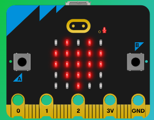

# Lab 03 Microbit
This lab will use a Micro:bit as an example of a less than virtual device that can be controlled by semantic kernel planner.

The Micro:bit has a 5x5 matrix of LEDs - which is why the lights labs have this representation.



## Prerequisites
1. As previous labs
2. A Microbit plugged in the the USB of the your laptop/PC

Hopefully some of the proctors can bring along a collection of these.

## Connecting to the Microbit
The Microbit presents itself as a serial port device to your PC. The port can be found out from Windows Device Manager, but it is often *COM3*.

The plugin opens a connection to a COM port on initialisation, so this should error if the Microbit is not plugged-in or presents itself on a different COM port. The code that may need amending is in the MicrobitPlugin.cs

```
public MicrobitPlugin()
{
    serialPort = new SerialPort("COM3", 115200);
    serialPort.Open();
    //send crt-c to stop any running program
    serialPort.Write(new byte[] { 0x03 }, 0, 1);
}
```

Amend the call to the serial port constructor, if you have issues.

## In this lab
The format of the LEDs on the Microbit is the same as that of the virtual lights in earlier labs, so you could try some of those experiments, but with something like *on the microbit* somewhere on the prompt.

You can try:
1. Turn on individual pixels
2. change the brightness of one pixel from it's current
3. Copy the state of the virtual lights to the microbit
4. Shapes on the Microbit
5. Letters on the microbit

## Further Experiments

